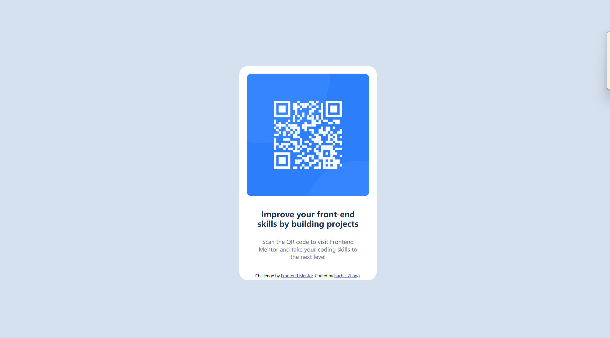

# Frontend Mentor - QR code component solution

This is a solution to the [QR code component challenge on Frontend Mentor](https://www.frontendmentor.io/challenges/qr-code-component-iux_sIO_H). Frontend Mentor challenges help you improve your coding skills by building realistic projects. 

## Table of contents

- [Overview](#overview)
  - [Screenshot](#screenshot)
  - [Links](#links)
- [My process](#my-process)
  - [Built with](#built-with)
  - [What I learned](#what-i-learned)
  - [Continued development](#continued-development)
- [Author](#author)
- [Acknowledgement](#acknowledgement)

## Overview

### Screenshot

### Links

- Solution URL: [Add solution URL here](https://your-solution-url.com)
- Live Site URL: [Add live site URL here](https://your-live-site-url.com)

## My process

### Built with

- Semantic HTML5 markup
- CSS custom properties
- Flexbox

### What I learned

- Center element using Flexbox
- Build a project after 2 years of tutorial hell

### Continued development

- Learn proper use of HTML semantics
- Recreate versions closer to original designs
- Do better at responsive layout

## Author

- Frontend Mentor - [@Rach1975](https://www.frontendmentor.io/profile/Rach1975)

## Acknowledgement
- Thank you [@Boris](https://www.frontendmentor.io/profile/mkboris) for feedback on responsiveness,  css reset and rem/px font-size problem!
